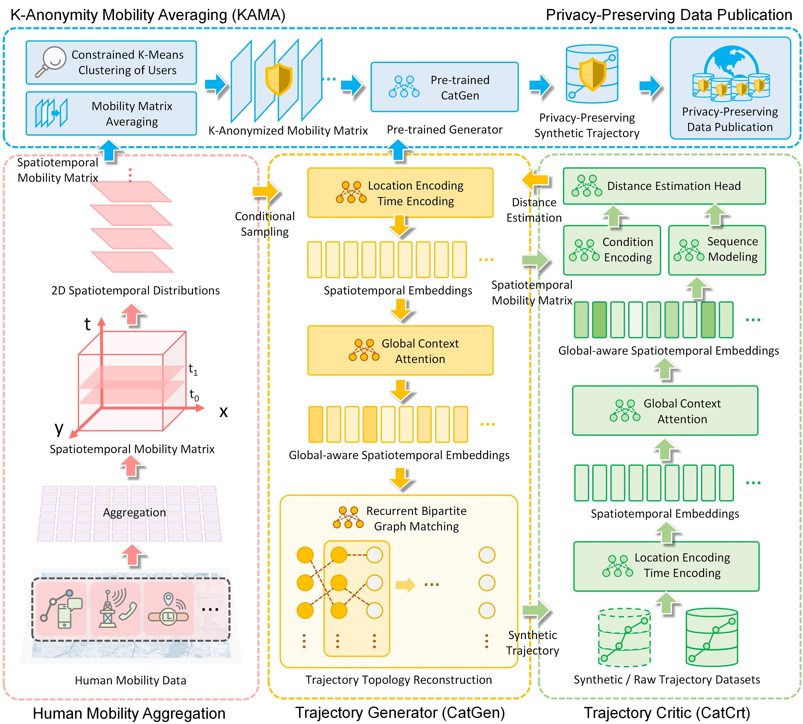
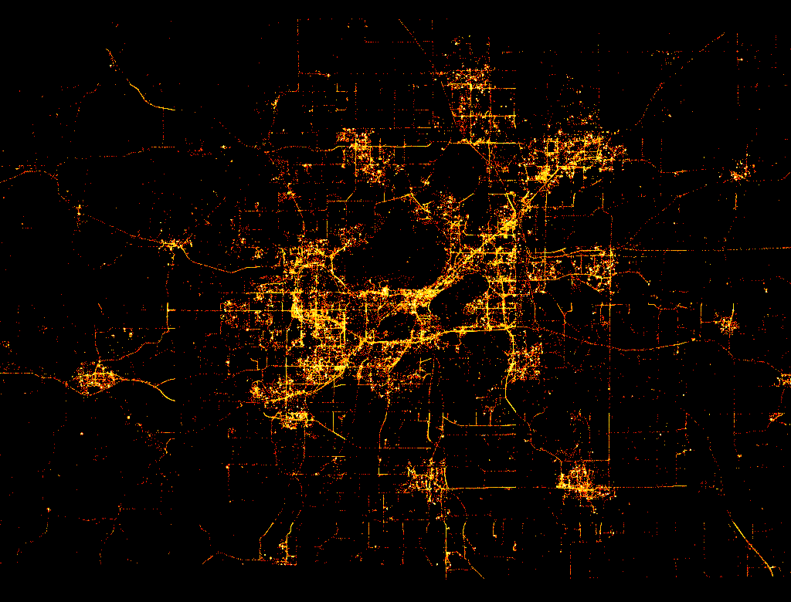
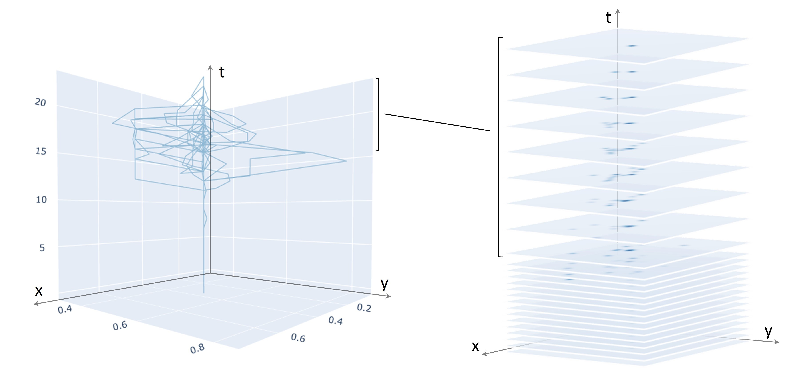

# Conditional Adversarial Trajectory Synthesis

CATS: Conditional Adversarial Trajectory Synthesis for Privacy-Preserving Trajectory Data Publication Using Deep Learning Approaches

## Abstract
The prevalence of ubiquitous location-aware devices and mobile Internet enables us to collect massive individual-level trajectory dataset from users. Such trajectory big data bring new opportunities to human mobility research but also raise public concerns with regard to location privacy. In this work, we present the Conditional Adversarial Trajectory Synthesis (CATS), a deep-learning-based GeoAI methodological framework for privacy-preserving trajectory data generation and publication. CATS applies K-anonymity to the underlying spatiotemporal distributions of human movements, which provides a distributional-level strong privacy guarantee. By leveraging conditional adversarial training on K-anonymized human mobility matrices, trajectory global context learning using the attention-based mechanism, and recurrent bipartite graph matching of adjacent trajectory points, CATS is able to reconstruct trajectory topology from conditionally sampled locations and generate high-quality individual-level synthetic trajectory data, which can serve as supplements or alternatives to raw data for privacy-preserving trajectory data publication. The experiment results on over 90k GPS trajectories show that our method has a better performance in privacy preservation, spatiotemporal characteristic preservation, and downstream utility compared with baseline methods, which brings new insights into privacy-preserving human mobility research using generative AI techniques and explores data ethics issues in GIScience.


<p align="center">
    
</p>

## Reference
If you find our code or ideas useful for your research, please cite our paper:

Rao, J., Gao, S., Zhu, S. (2023). [CATS: Conditional Adversarial Trajectory Synthesis for Privacy-Preserving Trajectory Data Publication Using Deep Learning Approaches](https://www.tandfonline.com/eprint/FJNDWSJUAJ9MUYNNQWAF/full?target=10.1080/13658816.2023.2262550). International Journal of Geographical Information Science. DOI: 10.1080/13658816.2023.2262550


```
@article{rao2023cats,
  title={CATS: Conditional Adversarial Trajectory Synthesis for Privacy-Preserving Trajectory Data Publication Using Deep Learning Approaches},
  author={Rao, Jinmeng and Gao, Song and Zhu, Sijia},
  journal={International Journal of Geographical Information Science},
  year={2023},
  volume={37},
  number={12},
  pages={1-33}
}
```

## Requirements

CATS uses the following packages with Python>=3.7.7

- numpy==1.21.6
- pandas==1.3.5
- torch==1.11.0
- torchmetrics==0.8.1
- scikit-learn==1.0.2
- scipy==1.7.3
- einops==0.4.1

## Dataset

We use the UberMedia (acquired by Near in 2021, https://near.com) Mobility Dataset as our experiment data source. UberMedia Mobility Dataset records large-scale long-term individual GPS traces with high spatiotemporal resolution. The dataset provides both geographic coordinates (i.e., latitude and longitude) and timestamps (i.e., date, day of week, time of day) of trajectory points. Device IDs are also provided in the dataset as anonymized identifiers for users. We choose the Dane County, Wisconsin where the state capital city Madison locates as the research area and extract the data collected from September 7, 2020 to November 29, 2020 (i.e., 12 weeks).

<p align="center">
    
</p>

Due to the non-disclosure agreement with the data provider and privacy concerns, we are not releasing the original individual-level GPS trajectory data but sharing the mocked individual GPS trajectory data with the same data structure and also the k-anonymized aggregated human mobility data used in the experiments.

## Directory Structure

### Overview

```
📁. 
├── 📁data
├── 📁datasets
├── 📁images
├── 📁models
├── 📁scripts
└── 📁utils
```

### Details

```
📁./data
├── 📁k_anonymized_stmm:: k-anonymized aggregated spatiotemporal mobility matrix data.
└── mocked_individual_gps_data.csv:: mocked individual GPS trajectory samples that have the same data structure as the raw data.
```

```
📁./datasets
└── stmm_dataset.py:: provides Dataset classes for training and testing CATS.
```

```
📁./images
├── framework.jpg:: the diagram of CATS framework.
├── overall_distribution.png:: the overall distribution of processed individual GPS trajectory  data.
└── visual_example.jpg:: a visual example of human mobility aggregation.
```

```
📁./models
└── cats.py:: provides a PyTorch implementation of CATS, including a TrajGenerator (CatGen) class and a TrajCritic (CatCrt) class.
```

```
📁./scripts
├── train_cats.py:: provides a training example code for CATS.
└── run_cats.py:: provides an inference example code for CATS.
```

```
📁./utils
├── log_util.py:: logging class.
└── aggregate_mobility_matrix.py:: generates the aggregated spatiotemporal mobility matrices from individual GPS trajectories.
```

## Usage

### Data Aggregation

<p align="center">
    
</p>

Convert individual GPS trajectory csv files to spatiotemporal mobility matrix npy files.

```
python -m utils.aggregate_mobility_matrix [--csv_path] [--save_path] [--agg_size]
```

Where `csv_path` is the path to csv file, `save_path` is the path to save npy file, `agg_size` is the aggregation size.

### Training

Train CATS using the preprocessed data.

```
python -m scripts.train_cats [--img_path] [--traj_path] [--save_path]
```

Where `img_path` is the spatiotemporal mobility matrix npy files, `traj_path` is the original individual GPS trajectory files, `save_path` is the path to save model weights. Note that currently  the original `img_path` and `traj_path` data are not released due to NDA and privacy concerns.

### Inference

Run CATS to generate synthetic trajectory data conditional on spatiotemporal mobility matrices.

```
python -m scripts.run_cats [--sstm_path] [--weight_path] [--save_path] [--epoch]
```

Where `sstm_path` is the spatiotemporal mobility matrix npy files, `weight_path` is the path to saved model weights, `save_path` is the path to save synthetic trajectory data.


### Repository References

We mainly referred to *PyTorch-GAN.* [Github](https://github.com/eriklindernoren/PyTorch-GAN)
